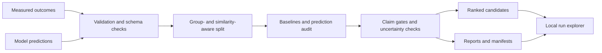

# AssayReady

AssayReady is a local toolkit for auditing sequence-function predictions and
turning them into reviewable candidate-prioritization packages. It combines
data validation, similarity-aware evaluation, baseline comparisons,
uncertainty checks, candidate ranking, and a browser-based results explorer.

The project is designed around a practical question: **is a prediction table
credible enough to guide the next experiment?** Its reports keep that answer
traceable to the data, split policy, evaluation semantics, and run artifacts.

## Highlights

- Detects invalid sequences, duplicate measurements, conflicting labels, and
  suspicious input rows before evaluation.
- Builds deterministic train/validation/test partitions that respect declared
  groups and sequence-similarity clusters.
- Compares supplied predictions with simple GC-, length-, and k-mer-based
  baselines before reporting model lift.
- Supports regression, binary classification, ranking, maximize/minimize
  objectives, and explicitly declared positive labels.
- Audits uncertainty against observed error without treating correlation as
  proof of calibration.
- Ranks candidates with uncertainty and diversity controls, then records
  nearest-reference evidence and risk flags for each result.
- Stores reproducible JSON, Markdown, and CSV artifacts and indexes local runs
  for later review in the UI.
- Includes Windows and Linux CI, wheel-install smoke tests, dependency auditing,
  and CycloneDX SBOM creation.

## Workflow



## Quick start

AssayReady requires Python 3.12.

```bash
python -m pip install -e ".[dev]"
assayready doctor
```

Run the bundled public example:

```bash
assayready audit-predictions \
  --config model_assessment/examples/public_dream_promoter_audit.json
```

The example is a bounded subset derived from the Random Promoter DREAM
Challenge 2022. Source and transformation details are documented in
[`model_assessment/examples/public_dream_promoter_source.md`](model_assessment/examples/public_dream_promoter_source.md).

For a locked scientific environment, use Pixi:

```bash
pixi install --environment model-assessment
pixi run --environment model-assessment doctor
pixi run --environment model-assessment smoke
```

## Audit your own predictions

A measured table should include a DNA sequence, a measured target, and a model
prediction. Sequence IDs, uncertainty values, and grouping columns such as
batch or construct family are strongly recommended.

```bash
assayready audit-predictions \
  --project promoter_review \
  --assay measured_predictions.csv \
  --candidates candidate_predictions.csv \
  --sequence-col sequence \
  --target-col measured_expression \
  --prediction-col model_prediction \
  --uncertainty-col model_uncertainty \
  --id-col sequence_id \
  --group-cols batch construct_family \
  --top-k 96
```

For repeatable analyses, start with
[`model_assessment/examples/prediction_audit.json`](model_assessment/examples/prediction_audit.json).
The evaluation manifest records objective direction, units, uncertainty
meaning, constraints, thresholds, and prediction provenance. Paths in a config
are resolved relative to the config file.

## Outputs

Each audit writes a self-contained artifact directory. Key files include:

| Artifact | Purpose |
| --- | --- |
| `prediction_audit_report.md` | Human-readable findings, warnings, and recommendation status |
| `prediction_audit_report.json` | Structured metrics and claim-gate results |
| `data_audit_report.md` | Data-quality and split-integrity review |
| `ranked_candidates.csv` | Prioritized candidates with scores and risk flags |
| `candidate_explanations.json` | Machine-readable evidence for each candidate |
| `processed/*.csv` | Exact evaluated partitions |
| `execution_manifest.json` | Runtime, parameters, checksums, and artifact inventory |

The default output root is `outputs/assayready/`. The SQLite run index and all
uploaded data remain local.

## Local UI

```bash
pixi run --environment model-assessment ui
```

Open `http://127.0.0.1:8050` to:

- run audits from uploaded tables;
- inspect benchmark plots, residuals, subgroup errors, and split diagnostics;
- search and compare indexed runs;
- review candidate evidence;
- read reports and download run artifacts.

The development server accepts loopback hosts only. Upload limits, artifact
path checks, bounded table rendering, local retention controls, and hidden
tracebacks reduce common risks in a local data-review tool.

## Design notes

**Leakage-aware evaluation.** Random row splits can place near-identical
sequences or related experimental groups on both sides of an evaluation.
AssayReady clusters declared groups and canonical k-mer signatures before
assigning partitions, then reports any remaining overlap.

**Baseline-first claims.** A complex predictor should outperform inexpensive
signals. Reports compare against transparent baselines and block stronger
language when data volume, split quality, prediction provenance, or lift is
insufficient.

**Explicit semantics.** Minimization tasks and positive-class selection are
part of the evaluation contract. This prevents a technically correct metric
from being interpreted in the wrong direction.

**Auditable artifacts.** Reports, processed partitions, candidate evidence,
and execution metadata are saved together. The run index points to those files
instead of replacing them with opaque database state.

## Repository map

```text
model_assessment/
  cli.py                    command-line workflows and report creation
  data_core/                ingestion, validation, tokenization, and loaders
  ml_core/                  baselines, split logic, model components, ranking
  examples/                 public, reproducible audit inputs
  assets/                   local UI styling
  ui.py                     Dash application and callbacks
  visualization.py          benchmark and diagnostic figures
tests/
  core/                     correctness, schema, split, and performance tests
  ui/                       UI behavior and path-security tests
scripts/
  prepare_public_*.py       public-example preparation
```

## Development

```bash
python -m pytest
python -m build
```

The test suite covers objective polarity, deterministic splitting, package
resources, run indexing, UI path boundaries, visualization behavior, golden
audits, and bounded performance regressions. CI tests on Windows and Linux,
builds the source distribution and wheel, installs the wheel outside the source
tree, runs the public audit, checks dependencies, and creates an SBOM.

## Scope and limitations

AssayReady is research software. Similarity-aware partitions reduce obvious
leakage risk but cannot prove that externally supplied predictions are
independent of the evaluation rows. Uncertainty diagnostics do not establish
calibration, and retrospective performance does not establish prospective
biological performance.

Candidate rankings are planning aids. Domain review and experimental validation
remain necessary before biological, clinical, environmental, or regulatory use.
