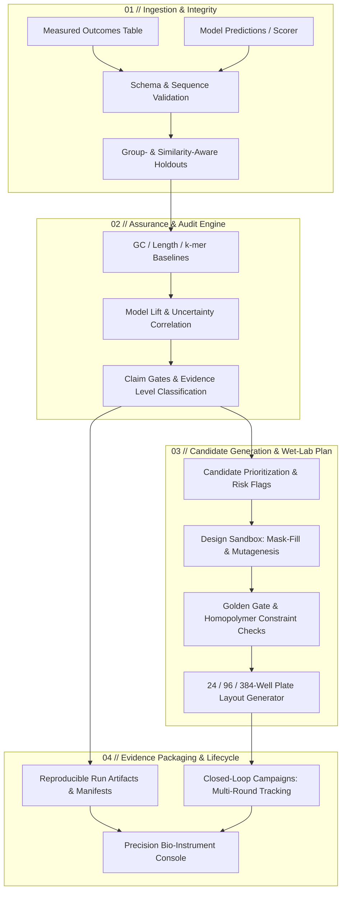

# AssayReady 2.0 (V2)

**The Precision Bio-Sequence Assurance Workstation & Candidate Generation Engine**

AssayReady is a local, privacy-first computational biology workstation and audit toolkit for evaluating sequence-function AI models, testing prospective claims, and prioritizing candidates for wet-lab synthesis. It unites rigorous data validation, similarity-aware leakage controls, baseline comparisons, uncertainty diagnostics, generative sequence design, and a high-density bio-instrument console.

The core question behind AssayReady: **is a prediction table credible enough to guide the next experiment?** AssayReady 2.0 answers this with traceable evidence chains, locked-holdout validation, and reproducible run artifacts.

---

## What's New in V2

| Feature Area | What V2 Delivers |
| --- | --- |
| **Precision Bio-Instrument Console** | Integrated, edge-to-edge 3-column workstation layout (`01 // WORKSPACE`, `02 // ANALYSIS CANVAS`, `03 // TELEMETRY & EVIDENCE`). Zero consumer pill buttons, hairline technical dividers (`1px solid #1e2632`), un-clipped full-width experiment history (`/runs`), and native Dash 4.x dark theme. |
| **Live Telemetry & Diagnostics** | Continuous header telemetry readout (`● ENGINE: PyTorch • RUN STORE: SQLite • HOLDOUTS: Leakage-Safe`), schema references, and real-time assurance pass/fail indicator gates. |
| **Design Sandbox & Generative Studio** | Generates synthetic sequence variants using **Mask-fill**, **Random mutagenesis**, or **Diversity sampling**. Applies configurable GC fraction, homopolymer limits, and exact **Golden Gate cloning constraints** (BsaI/BsmBI avoidance). |
| **Foundation Models & Assay Heads** | Built-in support for **DNABERT-2 117M** with authenticated SHA-256 weight downloads. Non-technical UI workflow to train lightweight frozen-backbone assay heads on sequence-outcome tables with automated forward-pass health checks. Multi-tier fallback to heuristic scoring. |
| **Automated Well-Plate Layouts** | Converts candidate selections into formatted 24-, 96-, or 384-well plate layouts with scientist-approved control well reservations. |
| **Closed-Loop Multi-Round Campaigns** | Hash-chained audit trails tracking model versions, dataset versions, locked candidate selections, and imported wet-lab measurements across iterative experimental cycles. |
| **Controlled Sandboxed Execution** | Runs external models in digest-pinned, network-disabled Docker/Podman containers with read-only filesystems and strict IO hash validation. |

---

## Core Highlights

- **Data Validation & Sanitization:** Detects invalid IUPAC characters, conflicting labels, duplicate measurements, and suspicious input rows before evaluation begins.
- **Leakage-Aware Holdouts:** Deterministic train/validation/test partitions that respect declared biological groups (batches, families) and sequence-similarity clusters (k-mer and edit-distance).
- **Baseline-First Model Lift:** Benchmarks complex neural architectures against transparent GC-, length-, and k-mer baselines before granting claim credibility.
- **Dual Assurance & Evidence Classification:** Decouples how an evaluation was established from the strength of claim supported; retrospective audits are never relabeled as prospective validation.
- **Uncertainty & Calibration Auditing:** Tests correlation between model uncertainty and observed error without assuming calibration.
- **Risk-Aware Candidate Prioritization:** Multi-objective ranking with diversity constraints, nearest-reference distance calculation, and explicit synthesis risk flags.
- **Local Run Store & Artifact Index:** Self-contained JSON, Markdown, and CSV run packages indexed into SQLite for instant local query and visual comparison.
- **Enterprise & API Readiness:** Token-authenticated REST API for ELN/LIMS integration, local path containment, and automated CycloneDX SBOM generation.

---

## V2 Workstation Workflow



---

## Assurance and Evidence Levels

Every evaluation produces two explicit, decoupled classifications:

### Assurance Level (How the evaluation was conducted)

| Assurance key | Display label | What it means |
| --- | --- | --- |
| `self_declared` | Self-declared audit | Inputs, provenance, and independence statements were supplied by the user without hash verification. |
| `provenance_verified` | Provenance-verified audit | Artifact checksums were supplied and verified against locked manifests. (Proves identity, not training independence). |
| `controlled_evaluation` | Controlled evaluation | AssayReady generated and held out the evaluation split while fitting and evaluating in one isolated execution. |
| `prospective_evaluation` | Prospective evaluation | Candidate selection was cryptographically locked before wet-lab measurements were conducted. |

### Evidence Level (The scientific strength of the claim)

| Evidence key | Display label | What it supports |
| --- | --- | --- |
| `insufficient_evidence` | Insufficient evidence | Required validation, baseline comparisons, or minimum samples were unavailable. |
| `descriptive_audit_only` | Descriptive audit only | Characterizes data distribution and predictions without supporting model credibility claims. |
| `retrospectively_credible` | Retrospectively credible | Predictor outperformed baselines on similarity-separated retrospective holdouts. |
| `locked_holdout_credible` | Locked-holdout credible | Retrospective checks passed with verified locked-holdout isolation. |
| `prospectively_demonstrated` | Prospectively demonstrated | Predeclared candidate selections yielded measured wet-lab outcomes meeting target policy criteria. |

---

## Quickstart & Installation

AssayReady requires Python 3.12+.

### 1. Base Installation (Lightweight Audit & Console)
Supports spreadsheet auditing, reports, candidate prioritization, and the V2 UI without heavy deep-learning dependencies:

```bash
python -m pip install .
```

### 2. Modeling & Foundation Model Extensions
Install model-training and foundation-model utilities when fitting assay heads or running local foundation models:

```bash
# Modeling support (PyTorch)
python -m pip install ".[modeling]"

# Foundation models (DNABERT-2, Transformers, PEFT, Safetensors)
python -m pip install ".[foundation-models]"

# Development, testing, and build tools
python -m pip install ".[dev]"
```

### 3. Scientific Environment with Pixi (Recommended)
For fully reproducible, locked scientific environments:

```bash
cd assayready
pixi install --environment assayready
pixi run --environment assayready doctor
pixi run --environment assayready smoke
```

---

## Launching the V2 Bio-Instrument Console

Start the local UI console on `127.0.0.1:8050`:

```bash
assayready-ui --host 127.0.0.1 --port 8050
```

Open `http://127.0.0.1:8050` in your browser to access the 3-column workstation:

- **`01 // WORKSPACE` (Navigation):** Direct access to `Analyze`, `Benchmarks`, `Runs`, `Candidates`, `Design Sandbox`, and `Settings`.
- **`02 // ANALYSIS CANVAS` (Main Workspace):**
  - **Analyze (`/analyze`):** Interactive audit launcher with file upload, automatic column role inference, and real-time execution feedback.
  - **Runs (`/runs`):** Full-width master-detail table of all past runs with un-clipped metrics, search filters, and docked evidence inspector.
  - **Candidates (`/candidates`):** Exploration grid with risk tags, nearest-reference sequence similarity, and CSV export.
  - **Design Sandbox (`/simulations`):** Mask-fill variant generator, constraint filters, and 96-well plate mapping.
  - **Benchmarks (`/benchmarks`):** Preloaded public benchmarks (DREAM Promoter 2022) for instant verification.
- **`03 // TELEMETRY & EVIDENCE` (Inspector):**
  - Live engine status (`PyTorch • Pixi • SQLite • Leakage-Aware`).
  - Expected column schema reference and active assurance check indicators.
  - Contextual live evidence metrics generated during analysis.

---

## Command-Line Auditing

### Audit an Existing Prediction Table
Audit supplied model predictions against measured outcomes with similarity clustering and baselines:

```bash
assayready audit-predictions \
  --project promoter_review \
  --assay measured_predictions.csv \
  --candidates candidate_predictions.csv \
  --sequence-col sequence \
  --target-col measured_expression \
  --prediction-col model_prediction \
  --uncertainty-col model_uncertainty \
  --id-col sequence_id \
  --group-cols batch construct_family \
  --top-k 96
```

### Reproducible JSON Configuration
For version-controlled audit pipelines, configure audits via JSON:

```bash
assayready audit-predictions --config assayready/model_assessment/examples/prediction_audit.json
```

### Run Bundled Public DREAM Benchmark
```bash
assayready audit-predictions --config assayready/model_assessment/examples/public_dream_promoter_audit.json
```

---

## Closed-Loop Multi-Round Campaigns

Connect model versions, dataset snapshots, locked candidate selections, and imported wet-lab outcomes across iterative campaigns:

```bash
# 1. Initialize campaign
assayready campaign create --campaign-id enzyme-a --name "Enzyme A" \
  --assay-type activity --objective-direction maximize --owner protein-team

# 2. Lock Round 1 candidate selection
assayready campaign add-round --campaign-id enzyme-a --round-number 1 \
  --model-version model-v7 --dataset-version data-v4 \
  --selection candidate_prioritization.csv --policy-pack protein_activity_v1

# 3. Import wet-lab outcomes after synthesis
assayready campaign import-outcomes --round-id enzyme-a-r001 \
  --outcomes measured_outcomes.csv

# 4. Compare round-over-round progress
assayready campaign compare --campaign-id enzyme-a
```

---

## Controlled Sandbox Execution & Batch Design

Execute models in a zero-network, read-only Docker/Podman container:

```bash
assayready model execute --spec controlled_execution.json
```

Generate a constraint-checked 96-well plate design from candidate rankings:

```bash
assayready batch-design --candidates candidate_prioritization.csv \
  --policy-pack promoter_regression_v1 --output draft_plate.csv
```

---

## Output Artifacts

Each audit creates an isolated, self-contained run folder under `outputs/assayready/<run_id>/`:

| Artifact | Format | Purpose |
| --- | --- | --- |
| `prediction_audit_report.md` | Markdown | Executive summary, evidence classification, baseline comparisons, and claim gates |
| `prediction_audit_report.json` | JSON | Machine-readable metrics, confidence intervals, and evaluation manifest |
| `data_audit_report.md` | Markdown | Data-quality audit, class distributions, and group/similarity split integrity |
| `candidate_prioritization.csv` | CSV | Canonical candidate rankings with scores, risk flags, and nearest-reference distances |
| `candidate_explanations.json` | JSON | Per-candidate attribution, uncertainty penalties, and diversity metadata |
| `processed/*.csv` | CSV | Exact train, validation, and test partitions used during the audit |
| `execution_manifest.json` | JSON | Complete execution environment, package versions, parameters, and SHA-256 file hashes |

---

## Repository Architecture

```text
pyproject.toml                  Repository-root package & dependency configuration
.github/workflows/ci.yml        CI workflow (Windows/Linux matrix, audits, SBOM)
assayready/
  pyproject.toml                Package specification & entry points
  pixi.toml                     Locked scientific Pixi environment definitions
  model_assessment/
    cli.py                      CLI subcommands & workflow orchestration
    ui.py                       V2 Precision Bio-Instrument Console (Dash 4.x)
    ui_launcher.py              Standalone local UI server entry point
    api.py                      Authenticated REST API for ELN/LIMS integration
    controlled_execution.py     Containerized sandbox model runner
    campaigns.py                Closed-loop multi-round campaign manager
    batch_design.py             Well-plate layout generator (24/96/384 wells)
    foundation_scoring.py       DNABERT-2 integration & task-head inference
    open_models.py              Authenticated weights downloading & verification
    schemas.py                  Pydantic data contracts & manifest validators
    run_store.py                SQLite run indexing & artifact catalog
    visualization.py            Plotly figures (residuals, split balance, heatmaps)
    assets/
      assayready.css            V2 Edge-to-Edge Instrument Console stylesheet
    data_core/                  Data ingestion, tokenization, and validation
    ml_core/                    Similarity clustering, baselines, ranking
    examples/                   Reproducible public audit templates
  tests/
    core/                       Unit tests for statistics, models, and schemas
    ui/                         UI navigation, callbacks, and security tests
docs/                           Detailed deployment, security, and hardware guides
```

---

## Scientific Scope & Limitations

1. **Research Tool:** AssayReady is computational research software. Its default thresholds and policy packs are structured development templates, not universal biological credibility standards. Thresholds must be calibrated to specific assay noise, biological effect size, and decision risk.
2. **Similarity Proxies:** k-mer similarity, sequence identity, edit distance, and embeddings are proxies for biological relatedness. They may not fully capture 3D structural changes, epigenetic effects, reading-frame shifts, host-organism context, or epistasis.
3. **Provenance vs. Independence:** Checksums and cryptographic hashes guarantee file identity and audit reproducibility; they do not mathematically prove that externally trained models never encountered evaluation sequences during pre-training.
4. **Uncertainty Calibration:** Uncertainty correlation checks measure relative error alignment; they do not constitute formal Bayesian calibration or conformal prediction guarantees.
5. **Human-in-the-Loop Requirement:** Candidate prioritization and well-plate layouts are decision-support aids. A trained scientist must review controls, synthesis constraints, biosafety flags, and biological plausibility before wet-lab execution.

---

## License

Licensed under the Apache License, Version 2.0. See [LICENSE.md](LICENSE.md) for details.
